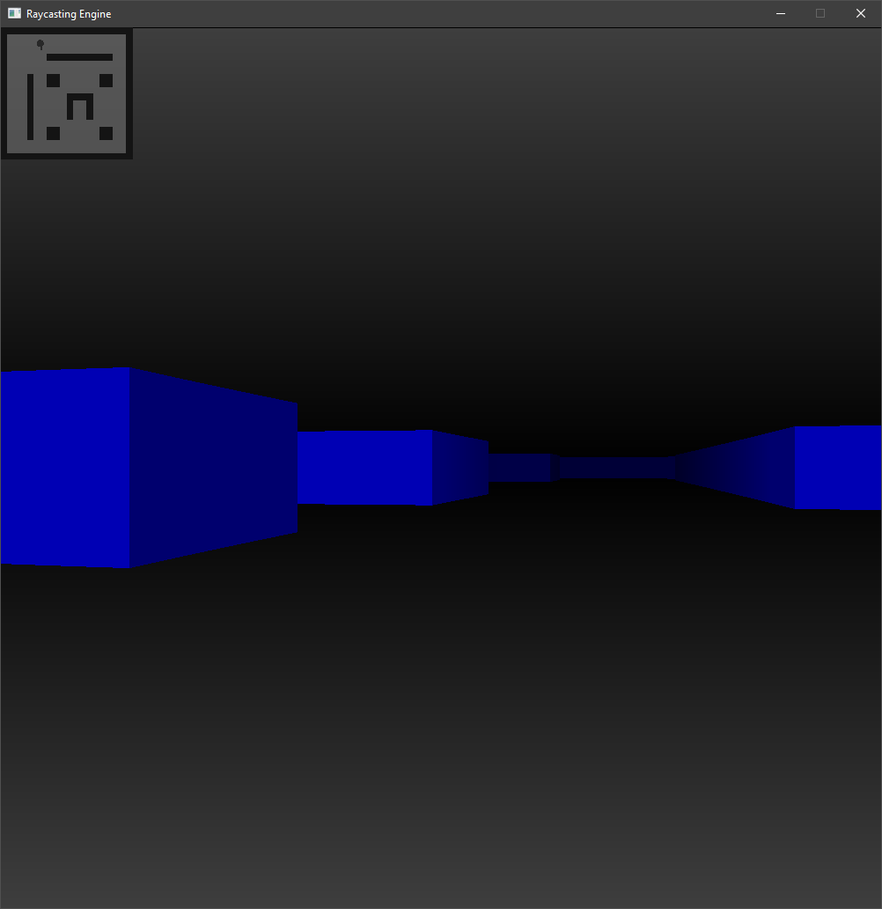

# Raycasting-Engine
A raycasting engine written in C++ with SFML

The camera is moved using the W, A, S, and D keys, and a map is displayed in the upper left corner of the program window. The map can easily be edited in the `mapLayout` array in the file Map.h.

 

  

